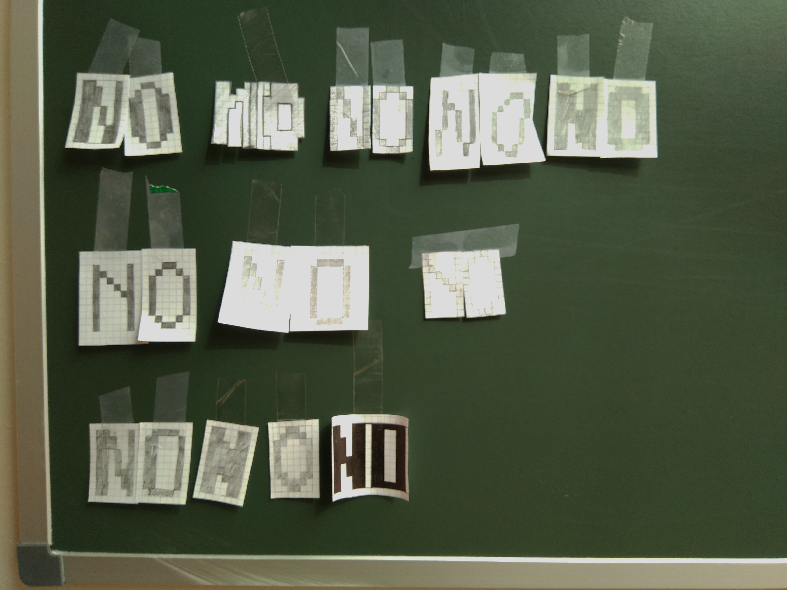
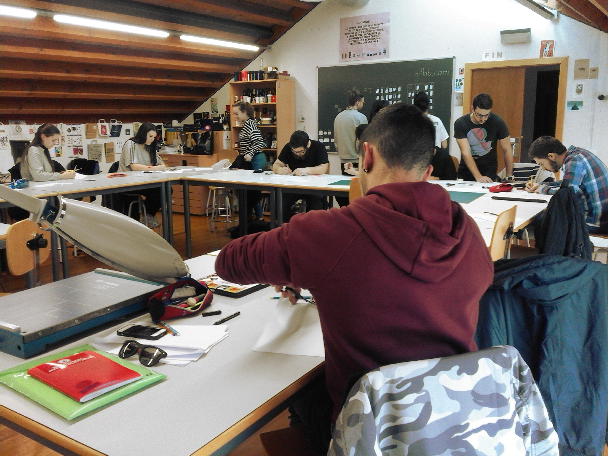
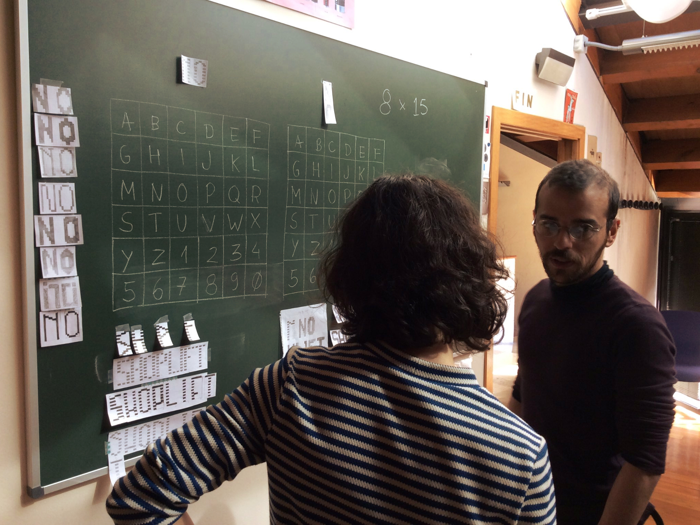
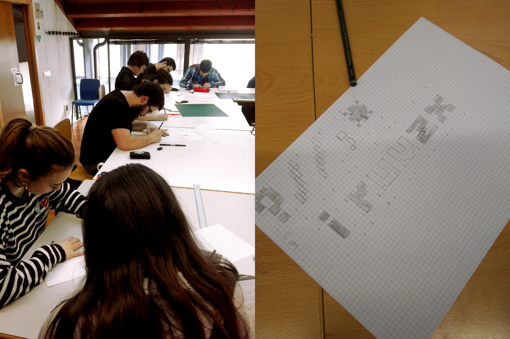

Title: Type:Bits
Summary: ASCII Art font design workshop at ESAPA, Avilés
Date: 2017-03-27 12:00
Author: manufactura
Category: Workshops
Tags: type
Slug: typebits
Lang: en

Type:Bits is a collaborative type design workshop series.

following on the steps of
[fonts.txt](http://manufacturaindependente.org/fontstxt).  The methodologies
and workflows that we employ to generate the fonts are mostly the same: paper
sketches are the starting point to design basic characters, which are then
digitised following the [Graphicore bitmap
font](http://graphicore.de/en/archive/2010-09-09_A-Brute-Font-Attack) format;
the Graphicore scripts are then used to create OpenType and TrueType versions
of these fonts.

As we continue to explore the possibilities of bitmap-based designs,  we took
the cue to expand on our tool chain. This time, instead of having participants
work on a text editor and manually gather the files using a USB stick or shared
folder, we worked with Git and GitLab. After a brief introduction to Git and
version control, we had everyone use GitLab's online editing interface and
commit their work to a shared repository.

[Type:Bits](https://gitlab.com/typebits) is now a Gitlab group where we are 
gathering the typefaces created in the bitmap font design workshops we have hosted so far:
fonts.txt at BAU, in Barcelona; Type:Bits at 
[Escuela de Arte Antonio Lopez](http://escueladeartetomelloso.org), in 
Tomelloso; and Type:Bits at [ESAPA](http://www.esapa.org), in Avilés. 

Besides the fonts, we have also published a repository with the [bitmap font
builder](https://gitlab.com/typebits/bitmapfontbuilder), which is our version
of Lasse Fister's original pipeline with minor tweaks, which we use to generate
font files from the text glyphs. We've also published the [base
template](https://gitlab.com/typebits/cookiecutter-bitmapfont) used to
bootstrap each new font. It is invaluable to us to be able to take the time to
review, organise and publish the small scripts and tools we make. GitLab made
it possible to share the work done in the workshops in a clean way. Commit
histories transparently document the rhythm of production and the contribution
of each participant.

  

    

  

  

    

  

  

    

  

  

    

  

Finally, we taking advantage of Gitlab pages to build an HTML specimen for the 
fonts. This is great for reviewing letter design as during the workshop (or 
after!) and quickly showcase the font.

This year, in Avilés, we did two workshops and ended up with four fonts: 
[Muralla](https://gitlab.com/typebits/font-muralla), 
[Roseta](https://gitlab.com/typebits/font-roseta), 
[Ladrillo](https://gitlab.com/typebits/font-ladrillo) and 
[Persiana](https://gitlab.com/typebits/font-persiana). 

We've also published three fonts created in our 2016 Type:Bits workshop in Tomelloso:
[Avestruz](https://gitlab.com/typebits/font-avestruz), 
[Flamingo](https://gitlab.com/typebits/font-flamingo) and 
[Tucan](https://gitlab.com/typebits/font-tucan). 

All of these fonts are under the Open Font License. They are now yours and ours
to use, improve, share and redistribute.

**Photo credits**: Ana Isabel Carvalho, Emilio Garcia Otero.
